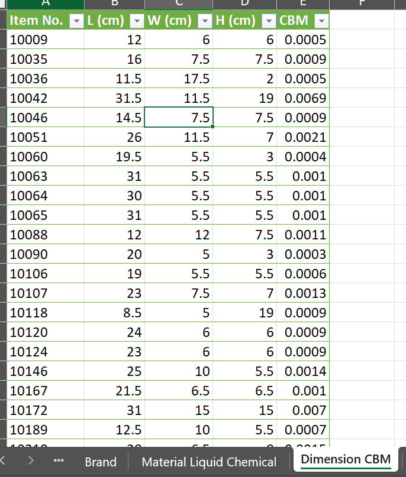
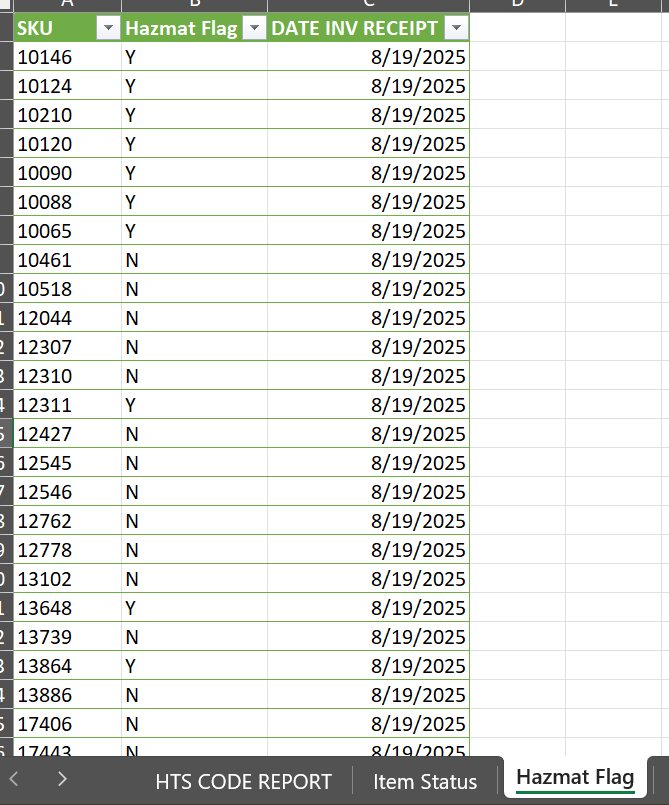
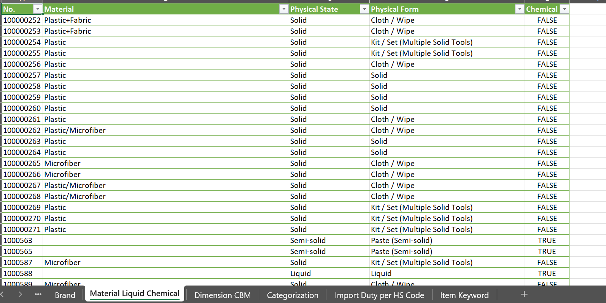

# 📦 Centralized Import Data Repository for Logistic Efficiency  

---

## 📘 Giới thiệu
Trong quy trình nhập khẩu, bộ phận Logistic cần các thông tin quan trọng như **MSDS, chất liệu, kích thước, HS code, thuế, hazmat, tên sản phẩm…** để khai báo hải quan và xử lý các nghiệp vụ liên quan.  
Trước đây, thông tin này **không được lưu trữ tập trung** — mỗi lần nhập hàng, bộ phận Merchandise phải cung cấp lại thông tin từ đầu, gây **lãng phí thời gian, nhân lực và tăng nguy cơ sai sót**.  

Dự án này được thực hiện nhằm **xây dựng một hệ thống dữ liệu tập trung (Import Database)** để quản lý và tái sử dụng toàn bộ thông tin sản phẩm nhập khẩu, giúp quy trình làm việc giữa Merchandise và Logistic hiệu quả hơn.

---

## 🎯 Mục tiêu dự án
- Xây dựng **Import Database** lưu trữ toàn bộ dữ liệu liên quan đến SKU nhập khẩu (thuế, material, dimension. cbm, HS code, brand…).  
- **Tái sử dụng thông tin cũ** cho các SKU đã từng nhập, tránh nhập tay lặp lại.  
- Tăng tốc độ cung cấp thông tin, **rút ngắn thời gian xử lý đơn hàng**.  
- Hỗ trợ bộ phận Logistic **truy cập dữ liệu tức thì** để khai báo hải quan, giảm rủi ro trễ hạn.

---

## 🧩 Giải pháp thực hiện
- **Xác định bộ dữ liệu cốt lõi** mà Logistic cần (thuế, HS code, material, dimension, MSDS, v.v).  
- **Thiết kế cấu trúc dữ liệu trong Excel** khoa học, dễ mở rộng và cập nhật.  
- **Sử dụng Power Query** để tổng hợp và hợp nhất dữ liệu từ nhiều nguồn (file cũ, đơn hàng mới, dữ liệu từ Merchandise).  
- **Tạo Data Model** trong Excel để đảm bảo các bảng liên kết chính xác.  
- **Tùy chỉnh hiển thị dữ liệu** qua Pivot Table hoặc Table view giúp người dùng dễ tra cứu, lọc và cập nhật.  
- Xây dựng **quy trình cập nhật định kỳ** mỗi khi có đơn hàng nhập khẩu mới.

---

## 📊 Kết quả đạt được
- Giảm thời gian cung cấp thông tin cho Logistic từ **vài giờ xuống chỉ còn vài phút** (đối với SKU cũ).  
- **Tận dụng 100% dữ liệu cũ**, loại bỏ việc nhập tay lặp lại.  
- Tạo nên **nguồn dữ liệu trung tâm duy nhất**, đảm bảo tính thống nhất và chính xác.  
- Cải thiện đáng kể **tốc độ phản hồi và hiệu suất phối hợp** giữa các phòng ban.  
- Dễ dàng mở rộng, tích hợp thêm dữ liệu trong tương lai (SKU mới, vendor mới…).

---

## 🛠️ Công cụ & Kỹ thuật sử dụng
- **Excel** (Data Model, Pivot Table, Data Validation)  
- **Power Query** (ETL – Extract, Transform, Load)  
- **Folder & File Structuring** for scalable data organization  
- **Team Communication & Requirement Gathering**  
- **Process Optimization** based on workflow and data analysis  

---

## 📸 Kết quả
### Hình ảnh mẫu - Dimenson, CBM

  

### Hình ảnh mẫu - Hazmat Flag

  

### Hình ảnh mẫu - Material

  

---

## ✉️ Tác giả
**Tram Dang Tai**  
📍 Merchandise Assistant Database  
📧 [Liên hệ qua LinkedIn](https://www.linkedin.com/in/tramdangtai)
